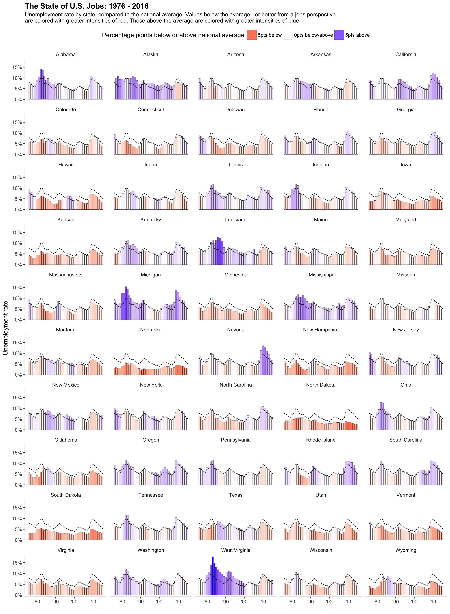

Workout Wednesday 2017 Week 3
================

##### Examining how unemployment varies in the US over time

hrbrmstr has a nice post about participating in Andy Kriebel's [data visualization workouts](http://www.makeovermonday.co.uk/) using `R`. See the link below for his take on the week's workout. As he says, the best way to improve with this stuff is to actually practice doing it. So I thought I'd give it a try and participate myself.

One thing I liked about [hrbrmstr](https://rud.is/b/2017/01/18/workout-wednesday-redux-2017-week-3/) and [Andy's](http://www.vizwiz.com/2017/01/workout-wednesday-state-of-us-jobs.html) visualizations (as well as [Matt's](http://thedailyviz.com/2016/12/14/four-decades-of-state-unemployment-rates-in-small-multiples-part-2/), the original author) is how each state's unemployment data is shown as a number *relative* to the national average. This is nice. It jumped out at me though that under this view we lose sight of how the nation is trending on its own. Is employment generally going up? down? We can't tell, because all we see is how the state is trending relative to the rest of the country.

With this in mind, I thought I'd try to build on their charts by constructing one that show's each state's data unnormalized, *overlaying* this with the national average. In this way, we see each state's raw unemployment figures, as well as a comparison to see how things are going relative to the rest of the country. See below for the chart, and below that for the code that was used to build it. You can access this code as an `R` script [here](scripts/main.R).

[](plots/us-unemployment.png)

``` r
# @author: josh weinflash
# @created: january 22 2017

# set path, load necessary packages / helper files ------------------------
source("helper.R")
library("ggplot2")

# load data and prep it a bit ---------------------------------------------
df_data = read.csv("data/staadata.csv", header = TRUE,
                   stringsAsFactors = FALSE)

# convert year to date
df_data$year = as.Date(sprintf("%s-01-01", df_data$year), 
                       format = "%Y-%m-%d")

# add field for unemployment rate
df_data$unemployment_rate = (df_data$unemployed / 
                               df_data$civilian_labor_force_population)

# build field for national average unemployment rate
df_data = plyr::ddply(df_data, "year", add_national_average)

# add field for difference b/w state and national average
df_data$difference = (df_data$national_average -
                      df_data$unemployment_rate)

# get rid of DC
df_data = df_data[df_data$state != "District of Columbia", ]

# build plot --------------------------------------------------------------
p1 = ggplot(df_data)

# add and format bars (each state's data)
p1 = p1 + geom_bar(aes_string("year", "unemployment_rate", fill = "difference"),
                   stat = "identity", color = "black", size = 0.1)

p1 = p1 + scale_x_date(date_labels = "'%y")

p1 = p1 + scale_y_continuous(breaks = scales::pretty_breaks(n = 3),
                             labels = scales::percent)

p1 = p1 + scale_fill_gradient2(name = "Percentage points below or above national average",
                               breaks = c(0.05, 0, -0.05),
                               labels = c("5pts below", "0pts below/above", "5pts above"),
                               low = "blue", mid = "white", high = "red",
                               midpoint = 0, guide = "legend")

# add and format trend line (national average)
p1 = p1 + geom_point(aes_string("year", "national_average"), size = 0.1)
p1 = p1 + geom_line(aes_string("year", "national_average"), size = 0.1)

# facet by state
p1 = p1 + facet_wrap("state", ncol = 5)

# modify some labels / theme elements so it looks cleaner
p1 = p1 + labs(x = "", y = "Unemployment rate")
p1 = p1 + labs(title = "The State of U.S. Jobs: 1976 - 2016",
               subtitle = paste0("Unemployment rate by state, compared to the national average. ",
                                 "Values below the average - or better from a jobs perspective -\n",
                                 "are colored with greater intensities of red. Those above the ",
                                 "average are colored with greater intensities of blue."))

p1 = p1 + theme(legend.position = "top")
p1 = p1 + theme(plot.title = element_text(face = "bold", hjust = 0))
p1 = p1 + theme(plot.subtitle = element_text(hjust = 0))
p1 = p1 + theme(panel.background = element_rect(fill = "white"))
p1 = p1 + theme(axis.line = element_line(color = "black"))
p1 = p1 + theme(strip.background = element_rect(fill = "white"))

# save to file
ggsave("us-unemployment.png", plot = p1, path = "plots/",
       width = 11, height = 15, units = "in")
```
